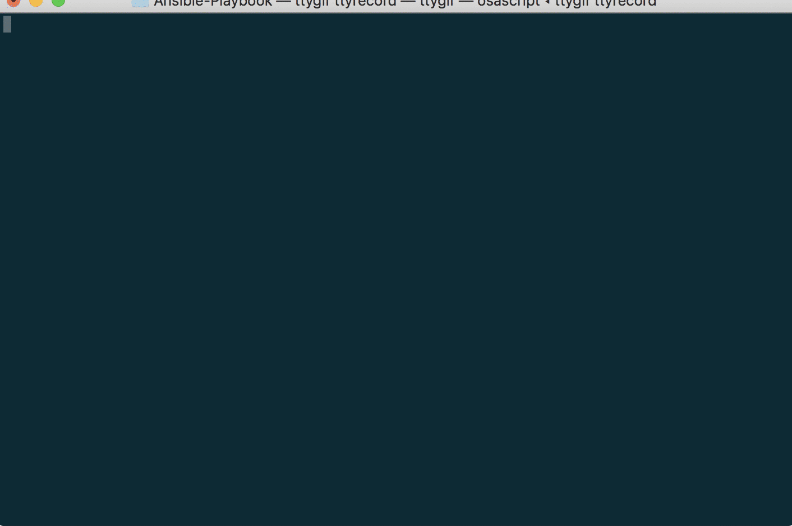

#### Ansible-Playbook

This project defines ansible roles arranged in a playbook in order to quickly
provision an OS X / iOS development environment.

In the future we'll add a build agent role as well

**If you like this project you can support me**  

<a href="https://www.buymeacoffee.com/mrcloud" target="_blank"></a>




### Prerequisite

- Xcode [Developer link](https://developer.apple.com/downloads)/[Mac App Store link](https://itunes.apple.com/us/app/xcode/id497799835) or Xcode command line tools installed:

```shell
xcode-select --install
```


- Ansible installed via pip

```shell
easy_install pip
pip install ansible
```

### Usage

- Edit [./roles/developer-setup/defaults/main.yml](./roles/developer-setup/defaults/main.yml) to select the packages you want to install
- Then run:
```shell
ansible-playbook -i inventory developer-setup-playbook.yml
```

### Roadmap

- Build & Test agent (CI, Sonar, Appium) role
